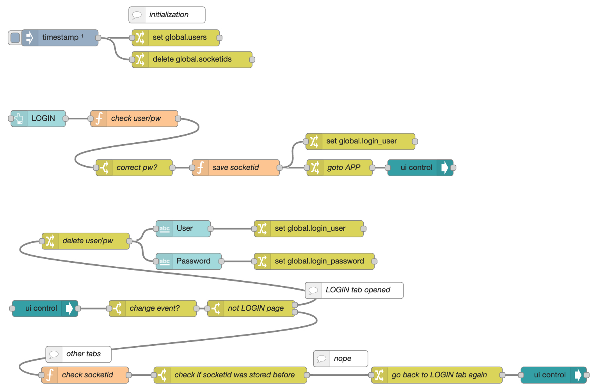

# node-red-dashboard-login-tab-control
Simple flow to login and control tab access

This flow has two tabs (respectively sub-flows)
- **LOGIN:** users and password are stored as global flow variables
- **APP:** a dummy app that is not accessible if the login was not successful

The access is controlled by using the socketid.

