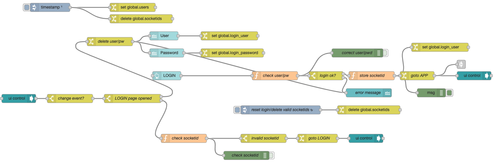

# node-red-dashboard-login-tab-control
Simple flow to login and control tab access

This flow has two tabs (respectively sub-flows)

- **LOGIN:** Users and password are checked. If correct, the sockeid ist saved in a global flow variable to be used later each time a Node-RED tab is accessed.
- **APP:** A dummy app that is not accessible if the login was not successful. Users are re-directed to the LOGIN tab.

The access is controlled by using the socketid.

